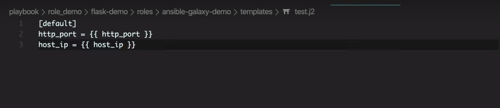

## tasks文件夹

这个文件夹就是role中模块出来的文件夹，其中有一个`main.yml`文件，这个文件就是外部引用role模块时候导入的tasks任务，而这个`main.yml`文件也可以进行task的进一步模块化。从而使得结构目录更加清除。

假设这个目录是安装python的role。那么就可以再分为两部分安装python所需要的依赖，以及安装python这两块。而`main.yml`文件只要对这个文件进行汇总即可，从而实现了代码的进一步结构化

```yaml
# main.yml文件内容
-  incloud:
     yum.yml
     pip.yml
```


## vars文件夹

存储属于这个role模块的变量，只要在这个文件夹中编写一个`main.yml`文件。将变量写入进去，从而可以直接在`/tasks`文件夹中进行引用，如下：

```yaml
# vars/main.yml文件内容
repo_url: https://github/com/xiaopeng163、flask-ansible_demo

```

```yaml
# tasks/main.yml文件内容
-  name: checkout sourcec code from github:
   git:
     repo: "{{ repo_url}}"
     dest: ~/flask-ansibsle-demo
```

## defaults文件夹

用来存放一些默认的变量


## files 文件夹

用来存放一些文件，可以被当前的tasks文件夹中的任务直接使用，这样子就不用在考虑task所需要的文件应该存放在哪里了。


## template文件夹

用来存放一些Jinj2模板文件，与files文件夹含义相同。template可以直接引用defaults文件夹与vars文件夹中的变量




## handlers文件夹

放置的是一个ansible的完整的task。在main.yml文件中使用`notify`关键字去告诉handle，该执行你这个handle了，但是需要注意的是，如果目标没有发生改变，那么task是不会执行的，对应的，`notify`关键字也是没有用的。而handles文件夹中也是有一个main.yml文件只会执行这个文件。而这一点与python其实上是一样的，如果py文件没有`main`函数，那么外部引用的时候也不会执行这个py文件，只会调用文件中的某些函数。

handles的作用：

通知服务的重启，因为目标发生改变了，那么这个task必然会被执行。

handles也可以定义在play-book文件中，只要和`tasks`同级即可。

```yaml
# 一个play-book文件，如何调用handler中的task
---
- hosts: test
  remote_user: dwchensenwen
  become: yes
  become_method: sudo
  tasks:
    - name: make file task1
      file: path=/data/task1.txt state=touch
      notify: task1
    - name: make file task2
      file: path=/data/task2.txt state=touch
      notify: task2

  handlers:
    - name: task1
      file: path=/data/1.txt 
      state: touch
    - name: task2
      file: path=/data/2.txt 
      state: touch
```

## ansible项目目录

现在添加了role模块，那么目录变成了什么样子

```bash
---module_demo
   |---flask_demo
   |   |---main.yml
   |   |---inventory
   |   |   |---group_var
   |   |   |   |---all.yml
   |   |   |---host_var
   |   |   |   |---host1.yml
   |   |   |---hosts
       |---roles
           |---deplay_role
               |---tasks
               |---defaults
               |----vats
               |---files
               |---handlers
```

