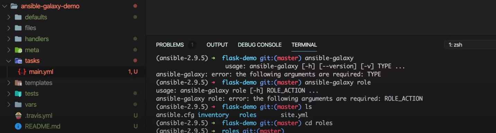
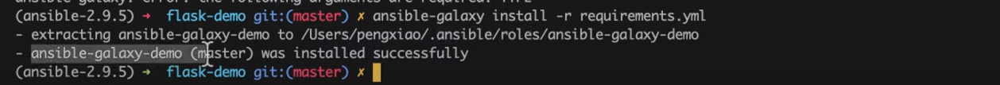

是从

`ansible2.9`版本开始有的。

我们可以使用ansible-galaxy去自动管理role模块

## 初始化role

```
# 进入指定目录初始化
cd roles
    ansible-galaxy role init  ansible_galaxy_demo
```



]

## 从github下载role

模仿python，在项目中有一个类似requirement.txt文件，这个文件是requirement.yml。我们在这个文件中课可以设置我们所需要的role.

```yaml
roles:
  -  src: https://github.com/xiaopeng163/ansible-galaxy-demo
     scm:git
     version: master
```

使用命令

```powershell
ansible install -r requirements.yml
```



这个roles会像python一样，将role安装到ansible的安装目录。从这里看，role就很向python的模块，因为可以安装role也可以删除role。

## galaxy库


ansible也像python一样有一个共享的role库。

[https://galaxy.ansible.com/home](https://galaxy.ansible.com/home)

### 如何从这个库中安装role

```bash
ansible-galaxy install xiaopeng163.ansible_galaxy_demmo
```


+ xiaopeng163是namespace，也就是一个用户的空间
+ ansible_galaxy_demmo也就是我们需要安装的role模块
+ 通过以上两部分，我们就可以成功的定位到一个role模块。

### 引用从galaxy库的role

我们安装好之后，就需要引用这个role，如何引用，与前面无区别，只要修改一下name即可

```yaml
tasks:
  -  name: xiaopeng163.ansible_galaxy_demmo
  
```

这里的role名称就是我们安装role时候输入的。


## requirement.yml

如果从库中安装role，那么requirement.yml怎么写,如下

```yaml
roles:
  -  src: xiaopeng163.ansible_galaxy_demo
     version: master
```

