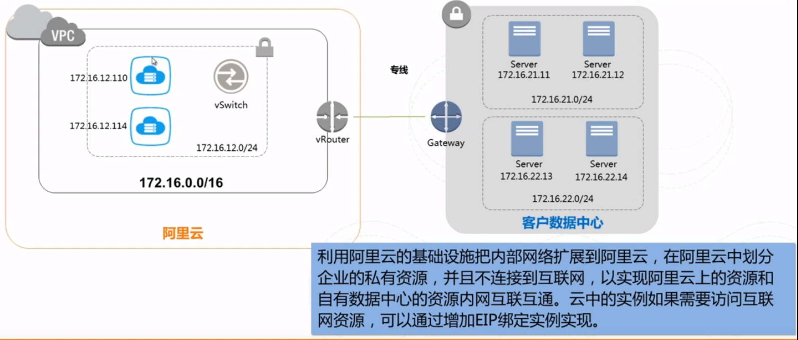
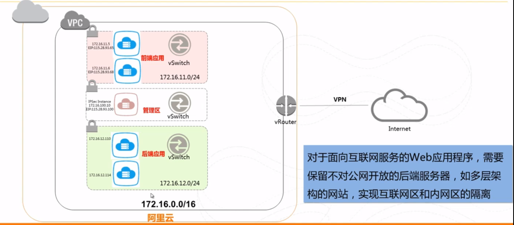

# 认证

与ec2进行交互的时候，需要指定认证依据，与ec2 api进行交互的时候，我们需要用到access key ID和secret access key。

## 环境变量

将access key ID和secret access key配置到环境变量中

```shell
export AWS_ACCESS_KEY_ID=...
export AWS_SECRET_ACCESS_KEY=...
```

## 配置文件

要想使用Ansible 所有关于EC2 的功能，需要在控制主机上安装Python Boto 类库。ansible是通过这个库与ec2进行所有功能的交互，所以只要配置好这个库，即可。

Boto配置文件是文本文件，其格式类似于.ini配置文件，该文件为控制Boto库行为的选项指定值。在Unix / Linux系统中，启动时，boto库将在以下位置按以下顺序查找配置文件：

- /etc/boto.cfg - for site-wide settings that all users on this machine will use
- (if profile is given) ~/.aws/credentials - for credentials shared between SDKs
- (if profile is given) ~/.boto - for user-specific settings
- ~/.aws/credentials - for credentials shared between SDKs
- ~/.boto - for user-specific settings

boto配置文件可能如下所示：

```ini
[Credentials]
aws_access_key_id = <your_access_key_here>
aws_secret_access_key = <your_secret_key_here>
```


# 配置ansible.cfg 

配置ansible.cfg 支持使用EC2.

当使用Ansible来配置EC2实例时，我在ansible.cfg里面添加了下面几行代码：

```
[defaults]
remote_user=ubuntu
host_key_checking=False
```

含义：

+ 在这些镜像中你应该使用ubuntu用户来进行SSH 操 作。

+ 关闭了主机密钥检查，因为我无法事先知道新实例上的主机密钥是什么。

# 启动新的实例

```
- name: start an instance with the packered ami
  hosts: localhost
  gather_facts: False
  tasks:
    - name: start a xenial instance from a known ami
      ec2:
        region: us-west-1
        image: ami-79df8219 # 参数表示Amazon 系统镜像（AMI）的ID
        instance_type: t2.micro # 实例类型
        key_name: mykey
        group: [web, ssh, outbound] # 参数表示与实例关联的安全组列表。
        instance_tags: #用EC2 的键值对标签的方式将元数据和实例关联在一起
          Name: packer test
      register: result
    - debug: var=result
```


## 获得最新的AMi

Ansible 附带了一个名为ec2_ami_find的模块，该模块将根据搜索条件（如镜像名称或 者标签）检索AMI列表。

```
- name: find xenial image
  hosts: localhost
  gather_facts: False
  tasks:
    - name: find the image
      ec2_ami_find:
        name: "ubuntu/images/ebs-ssd/ubuntu-xenial-16.04-amd64-server-*"
        sort: name
        sort_order: descending
        sort_end: 1
        no_result_action: fail
      register: ami
    - name: output image info
      debug: var=ami
```

镜像的名称 总是以时间戳结束,ec2_ami_find模块的name选项允许使用*作为通配符，所以我们获取最新镜像的方法 是按照名称倒序排序的，并限制只搜索一个项目。

## EC2 密钥对


### 创建新的密钥

Amazon 不会保存私钥的副本，因此你需要在生成之后保存好它。

```##
- name: make a keypair
  hosts: localhost
  gather_facts: False
  tasks:
    - name: create mykey
      ec2_key: name=mykey region=us-west-1
      register: keypair
    - name: write the key to a file
      copy:
        dest: files/mykey.pem
        content: "{{ keypair.key.private_key }}"
        mode: 0600
      when: keypair.changed # 只有状态被改变了，说明生成了新的密钥，保存密钥
    - name: dump var
      debug: var=keypair
```

### 上传已有密钥


## 安全组

在使用它们之 前用ec2_group模块来确认这些安全组是否已经被创建。

```yaml
- name: create security groups
  hosts: localhost
  gather_facts: False
  vars:
    region: us-west-1
  tasks:
    - name: web security group
      ec2_group:
        region: "{{ region }}"
        name: web
        description: allow http and https access
        rules:
          - proto: tcp
            from_port: 80
            to_port: 80
            cidr_ip: 0.0.0.0/0
          - proto: tcp
            from_port: 443
            to_port: 443
            cidr_ip: 0.0.0.0/0

    - name: ssh security group
      ec2_group:
        region: "{{ region }}"
        name: ssh
        description: allow ssh access
        rules:
          - proto: tcp
            from_port: 22 # 允许的端口起始端口
            to_port: 22  # 允许的端口终止端口
            cidr_ip: 0.0.0.0/0 # 允许连接的子网ip地址，使用CIDR表示法

    - name: outbound group
      ec2_group:
        region: "{{ region }}"
        name: outbound
        description: allow outbound connections to the internet
        rules_egress:
          - proto: all
            cidr_ip: 0.0.0.0/0

```


# 将ec2加入到群组中。

```

```


TODO


# 等待服务器启动

能在提交了创建EC2 实例的请求后不能立刻对它执行playbook。因为势力创建需要花费一点时间

```yaml
- name: START THE INSTANCE
  ec2:
    region: us-west-1
    image: ami-79df8219 # 参数表示Amazon 系统镜像（AMI）的ID
    instance_type: t2.micro # 实例类型
    key_name: mykey
    group: [web, ssh, outbound] # 参数表示与实例关联的安全组列表。
    instance_tags: #用EC2 的键值对标签的方式将元数据和实例关联在一起
      Name: packer test
    wait: yes
  register:ec2
- name: wait for ssh server to be running
  wait_for: host={{ item.public_dns_name}}
  with_items: "{{ec2.instances}}"
```

wait_for的调用过程使用了search_regex参数在连接到主机之后查找OpenSSH 字符串。因此在创建实例task之后放上这个task，可以有效进行同步，保证全部实例被创建好之后，才继续执行。

# 完整的流程

下面总结一下，上面的步骤，整合成一个完整的yaml。从创建ec2实例开始

```yaml
---
- name: launch webservers
  hosts: localhost
  vars:
    region: us-west-1
    instance_type: t2.micro
    count: 1
  tasks:
  - name: ec2 keypair
    ec2_key: "name=mykey key_material={{ item }} region={{ region }}"
    with_file: ~/.ssh/id_rsa.pub
  - name: web security group
    ec2_group:
      name: web
      description: allow http and https access
      region: "{{ region }}"
      rules:
        - proto: tcp
          from_port: 80
          to_port: 80
          cidr_ip: 0.0.0.0/0
        - proto: tcp
          from_port: 443
          to_port: 443
          cidr_ip: 0.0.0.0/0
  - name: ssh security group
    ec2_group:
      name: ssh
      description: allow ssh access
      region: "{{ region }}"
      rules:
        - proto: tcp
          from_port: 22
          to_port: 22
          cidr_ip: 0.0.0.0/0
  - name: outbound security group
    ec2_group:
      name: outbound
      description: allow outbound connections to the internet
      region: "{{ region }}"
      rules_egress:
        - proto: all
          cidr_ip: 0.0.0.0/0
  - name: Get the ubuntu xenial ebs ssd AMI
    ec2_ami_find:
      name: "ubuntu/images/hvm-ssd/ubuntu-xenial-16.04-amd64-server-*"
      region: "{{ region }}"
      sort: name
      sort_order: descending
      sort_end: 1
      no_result_action: fail
    register: ubuntu_image
  - set_fact: "ami={{ ubuntu_image.results[0].ami_id }}"
  - name: start the instances
    ec2:
      region: "{{ region }}"
      image: "{{ ami }}"
      instance_type: "{{ instance_type }}"
      key_name: mykey
      group: [web, ssh, outbound]
      instance_tags: { Name: ansiblebook, type: web, env: production }
      exact_count: "{{ count }}"
      count_tag: { type: web }
      wait: yes
    register: ec2
  - name: add the instance to web and production groups
    add_host: hostname={{ item.public_dns_name }} groups=web,production
    with_items: "{{ ec2.tagged_instances }}"
    when: item.public_dns_name is defined
  - name: wait for ssh server to be running
    wait_for: host={{ item.public_dns_name }} port=22 search_regex=OpenSSH
    with_items: "{{  ec2.tagged_instances }}"
    when: item.public_dns_name is defined

- name: configure webservers
  hosts: web:&production
  become: True
  gather_facts: False
  vars:
    ansible_python_interpreter: /usr/bin/python2.7
  pre_tasks:
    - name: install python
      raw: apt-get install -y python2.7
  roles:
    - web

```

# vpc

虚拟加密云，这个其实就相当于将数据中心搬到了云上。可以完全掌控vpc，包括自有ip范围划分、划分网段、配置路由表和网关等也可以通过vpn等连接方式将vpc与传统数据中心组合成一个按需定制的网络环境，实现应用的平滑迁移。

vpc特点：

+ 完全隔离，使用隧道技术达到与传统vlan相同隔离效果的广播或者隔离在实例网卡应用。
+ 软件定义网络，管理实时生效。


## 应用场景

### 资源扩展



## 独立vpc



## 混合云


## ansible构建vpc

创建带有Internet路由表的两个子网的VPC。

```yaml
---
- name: create vpc
  hosts: localhost
  gather_facts: False
  vars:
    region: us-west-1
  tasks:
    - name: create a vpc
      ec2_vpc_net:
        region: "{{ region }}"
        name: "Book example"
        cidr_block: 10.0.0.0/16
        tags:
          env: production
      register: result
    - set_fact: "vpc_id={{ result.vpc.id }}"
    - name: add gateway
      ec2_vpc_igw:
        region: "{{ region }}"
        vpc_id: "{{ vpc_id }}"
    - name:  create web subnet
      ec2_vpc_subnet:
        region: "{{ region }}"
        vpc_id: "{{ vpc_id }}"
        cidr: 10.0.0.0/24
        tags:
          env: production
          tier: web
    - name: create db subnet
      ec2_vpc_subnet:
        region: "{{ region }}"
        vpc_id: "{{ vpc_id }}"
        cidr: 10.0.1.0/24
        tags:
          env: production
          tier: db
    - name: set routes
      ec2_vpc_route_table:
        region: "{{ region }}"
        vpc_id: "{{ vpc_id }}"
        tags:
          purpose: permit-outbound
        subnets:
          - 10.0.0.0/24
          - 10.0.1.0/24
        routes:
          - dest: 0.0.0.0/0
            gateway_id: igw

```


# 构建AMI

## 使用ec2 ami模块使用ec2 ami模块

ec2_ami模块会为一个正在运行的实例创建快照并将其保存成一个AMI。例14-16 列出 了一个此模块的实践案例。

```yaml
- name: create am AMI
  hosts: localhost
  vars:
    instance_id: i-e5bfc26641f1b918
  tasks:
    - name: create the AMI
      ec2-ami:
      description: Ubuntu16.64 with nginx installed
      instance_id: "{{ instance_id }}"
      wait: yes
    register:ami
  - name: ouput ami details
    deug: var=ami
```

上面是为一个实例创建一个快照

