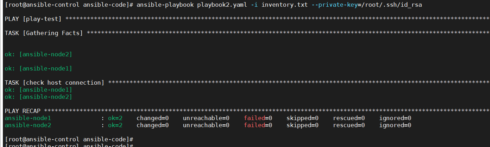
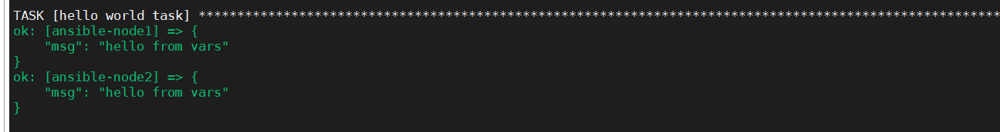

play book的配置文件是使用yaml文件写的

+ 一个paly book基本单位是hosts。hosts下面有name与task两部分组成

	+ name 指的是这个hosts是是干什么用的
	+ tasks由一系列小组成。

下面有一个demo的配置文件，就是使用playbook去执行ping命令

```
hosts: web1
name: play-test
tasks: 
 - name: check host connection
 - ping:
```


效果



## play book单位

常⽤属性 

+ name 属性每个play的名字 hosts 属性, 每个play 涉及的被管理服务器，同ad-hoc 中的资 产选择器 

+ tasks 属性, 每个play 中具体要完成的任务，以列表的形式表达
+ become 属性，如果需要提权，则加上become 相关属性 
+ become_user 属性, 若提权的话，提权到哪个⽤户上 
+ remote_user属性，指定连接到远程节点的⽤户，就是在远程 服务器上执⾏具体操作的⽤户。若不指定，则默认使⽤当前执 ⾏ ansible Playbook 的⽤户

一个play book中可以有多个play项目，如下,是一个play项目：

```
-  name: the first play example
   hosts: webservers
   remote_user: root
   tasks:
```

tasks中任务的多种写法

```
module_name: name=nginx enabled=true state=started
# 多⾏的形式:

module_name: name=nginx
         enabled=true
         state=started
# 多⾏写成字典的形式:

name: nginx
module_name:
 enabled: true
 state: started
```

## play book的校验
### 校验

下⾯校验的⽅法，只能校验PlayBook是否正确，⽽不能校验YAML ⽂件是否语法正确。

```
 ansible-playbook -i hosts myplaybook.yml --syntaxcheck
```

使用检查yaml的方式，对playbook进行检查

```python 
 python -c 'import yaml,sys; print yaml.safe_load(sys.stdin)' < myplaybook.yml
```


### 单步调试

每次都会执行一个task

```shell
// 执⾏Task中的任务，需要⼿动确认是否往下执⾏。
ansible-playbook -i hosts myplaybook.yml --step
```

 

### 模拟执行

检测自己的playbook有无语法错误，是不是能够直接执行，只是一个测试方式

```
ansible-playbook -i hosts myplaybook.yml -C
```

`-C` 其实应该就是`--checkout`

### 调试信息查看

```
ansible-playbook -i hosts myplaybook.yml -VVV
```

v越多越详细，支持到5个v。执行过程的每一条语句都回输出来。

有个思路就是先限制组再增加日志输出，从而可以定位到报错

```bash
 ansible-playbook -i hosts checkhosts.yml --limit dbservers -vvv
```


# Variables

定义变量

```
- name: Hello world
  hosts: web1
  vars:
   greeting: "hello from vars"
  tasks:
   - name: hello world task
     debug: 
       msg: "{{greeting}}"
        
```

定义的变量可以在tasks中被引用。



变量也可以定义字典和数组

```
- name: Hello world
  hosts: web1
  vars:
   greeting: "hello from vars"
   demo:
    a:
     - a: 1
     - b: 2
  tasks:
   - name: hello world task
     debug: 
       msg: "{{demo}}"
```


变量也可以通过外部进行导入变量

```yaml
- name: Hello world
  hosts: web1
  vars_files: 
   - vars_file/vars/demo.yaml
   vars:
    greeting: "hello from vars"
  tasks:
   - name: hello world task
     debug: 
       msg: "{{demo}}"
```

这样子的好处就是统一管理变量


变量优先级：

简单的来说就是后面覆盖前面。

两种情况，

+ 变量都在文件中，前面文件中的变量会被后面文件中定义的相同的变量覆盖
+ 外部引用的文件中的变量会被自己文件中后面定义的变量覆盖掉。


# group变量与host变量

这里的变量指的是主机变量，比如，主机名、主机密码、主机端口等等。是主机级别的


这里需要一个文件和两个文件夹。

一个文件是host文件，这个文件中，介绍了有多少主机，就和`/etc/passwd`一样，介绍了有多少个用户，而另外两个文件夹，分别是group文件夹和host文件夹。


源`investory`文件

内容如下：

```
[web]
ansible-node1 ansible-connection=ssh ansible_user=root 

[db]
host1 ansible-connection=ssh ansible_user=root http_port=443
ansible-node3 ansible-connection=ssh ansible_user=root
ansible-node4 ansible-connection=ssh ansible_user=root
```

进行划分


其中host中，只有节点的主机名

```
[all]
ansible-node1 
ansible-node2
ansible-node3
ansible-node4
host1
```


group_vars中包含了分组变量文件，每个文件包含了一个分组的变量，比如上文中的db.yaml.

```
ansible-connection: ssh 
ansible_user: root 
```


host_vars文件中，包含了多个文件，其中的每一个文件代表的都是一台节点机的单独配置，你可以将其单独配置写入其中

```
http_port
```


# ansible.cfg

这个文件是配置文件，我们可以将investory配置文件写入，这样子执行的时候，就不用用参数`i`去指定路径了。

有三个地方可以寻找这个文件，优先级从前到后i

+ 首先会在执行ansible的当前目录寻找这个文件
+ 会查找环境变量中的`ANSIBLE_CONFIG`查找这个配置文件
+ 最后才会使用`/etc/ansible`中的ansible.cfg这个配置文件。

ansible适合放的是ansible级别的变量，比如private-key的目录和username等。


# 过滤器

##  默认过滤器

为没有定义内容的变量设置一个变量

```
＂HOST＂: ＂{{ database_host | default('localhost')}}＂,
```

如果变量database_host已被定义，那么直接使用这个值。没被定义，则会设置成localhost这个默认值

## 文件路径的过滤器

basename过滤器可以让我们从全路径中提取文件名部分


## 过滤器编写

TODO

# lookup模块

与系统进行交互，是一个函数，被的jinj2模板所调用

格式统一都是

```yaml
{{ lookup('lookup_name','params')}}
```


## file

获取系统的相应文件的内容

```
- name: add my public key as ec2 key
  ec2_key: name=mykey key_matrial="{{ lookup('file','/Usr/id_rsa.pub')}}"
```

在playbook中就可以调用key_matrial这个变量获取到对应文件中的密钥信息

 ## pipe 

执行一条命令，获取这条命令的结果

```YAML
- name: get sha of most recent commit
  debug: msg="{{lookup('pipe','git rev-parse HEAD')}}"
```


## env 

获取到系统变量

```python
- name: get the current shell
  debug: msg="{{lookup('env','SHELL')}}"
```

##  template 

lookup会让你指定一个Jinja2模板文件，然后返回这个模板渲染的结果。

```yaml
- name: output messahe from template
  debug: msg="{{ lookup(\'template\',\'message.j2\') }}"
```


## csvfile 

获取csv中对应位置的数据

## dnstxt 

获取对应dns的ip

```shell
- name: look up TXT record
  debug: 
    msg: ＂{{ lookup('dnstxt','baidu.com')}}"
```


## redis_kv 

```shell
- name: look up value in Redis
  debug: msg=＂{{ lookup( 'redis_kv','redis://localhost:6379,weather') }}"

```


# include

include 获取到的是整个文件

静态引用


