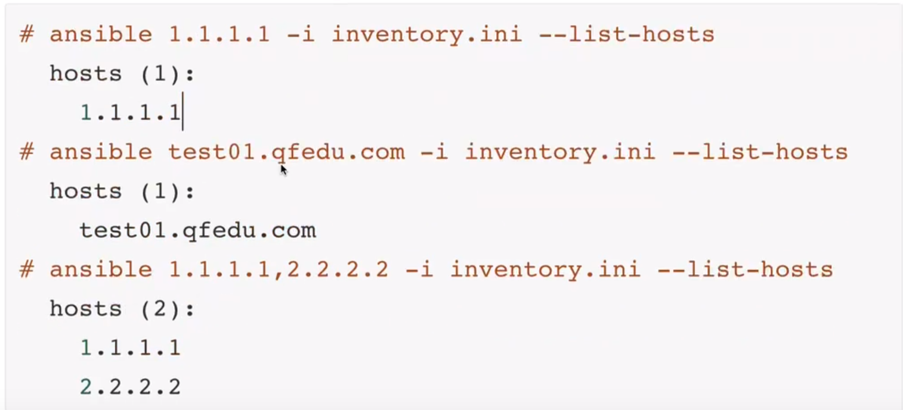

资产选择器，就是运行ansible时，选择运行哪些节点

```
ansible partten -i inventory.yml -m module -a argement
```

其中partten就是资产选择器，可以选择组亦可以选择其中的某个节点。

资产选择器中，写了什么partten就要用什么，而不是写解析的东西。

## 选择一台




## 选择一组


选择父组的时候，也会把子组写出来。

## 选择多台

使用匹配符


使用逻辑符

### 并集


### 交集


### 排除


### 正则表达式

### 数字范围

  hosts: web[:5]

### 通配符

  hosts: w*b