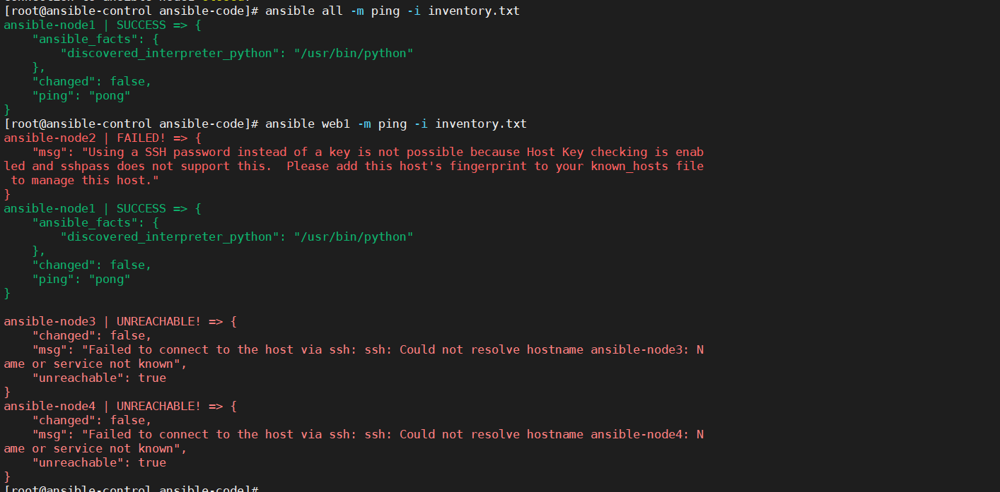

# 作用

就是记录资产，因为控制器需要控制多台节点，那么我们就需要把这些节点都放在同一个节点中。所以，我们可以在investory文件中定义我们的设备列表，然后通过ansible控制器去统一管理。

不用在每一台机子上都配一个ansible，control可以直接通过ssh去控制其他设备。

最简单的investory文件

```shell
ansible-node1 ansible-connection=ssh ansible_user=root ansible_ssh_pass=toor
```

效果

```shell
[root@ansible-control ansible-code]# ansible ansible-node1  -m ping -i inventory.txt
ansible-node1 | SUCCESS => {
    "ansible_facts": {
        "discovered_interpreter_python": "/usr/bin/python"
    },
    "changed": false,
    "ping": "pong"
}

```

# 节点管理

+ 我们可以通过`all`命令进行所有节点管理

+ 也可以管理单一节点,使用`ansible-node1`这种资产名称访问单一节点

```
ansible-node1 ansible-connection=ssh ansible_user=root ansible_ssh_pass=toor
ansible-node2 ansible-connection=ssh ansible_user=root ansible_ssh_pass=toor
```

+ 也可以进行部分节点统一管理

```
[web1]
ansible-node1 ansible-connection=ssh ansible_user=root ansible_ssh_pass=toor
ansible-node2 ansible-connection=ssh ansible_user=root ansible_ssh_pass=toor
```

在上面这个文件中，如果我们使用

```
ansible web1  -m ping -i inventory.txt
```

那么我们就可以对`ansible-node1`和	`ansible-node2`进行统一管理。

+ 通过正则匹配节点名称，进行管理

```
[web1]
ansible-node[1:4] ansible-connection=ssh ansible_user=root ansible_ssh_pass=toor
```

我们访问web1的时候，我们就会去访问控制四台节点机。




## ansible目录结构

由两部分组成

```
----site.yaml 作为playbook
|
---investory文件
        |
        -----project1
               |---hosts文件
               |---grouop_vars文件
               |----host_vars文件
        ------project2 
               |---hosts文件
               |---grouop_vars文件
               |----host_vars文件
```


选择不同的project，只要在ansible.cfg中指定hosts文件即可。

```
[defaults]
investory = investory文件/projects/hosts文件
```

