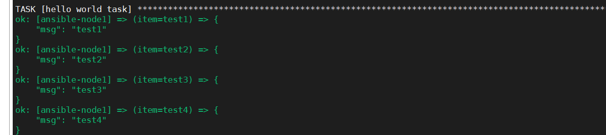
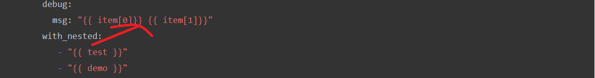
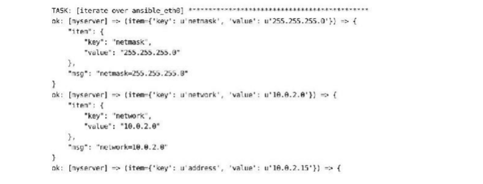

## 单层循环

```powershell
- name: Hello world
  hosts: web1
  vars:
    test:
     - test1
     - test2
     - test3
     - test4
  tasks:
   - name: hello world task
     debug: 
       msg: "{{ item }}"
     with_items: "{{ test }}"
```




## 双层循环


```bash
- name: Hello world
  hosts: web1
  vars:
    test:
     - test1
     - test2
     - test3
     - test4
    demo:
      - demo1
      - demo2
      - demo3
      - demo4
  tasks:
   - name: hello world task
     debug: 
       msg: "{{ item[0]}} {{ item[1]}}"
     with_nested: 
        - "{{ test }}"
        - "{{ demo }}"
```

注意：

debug与with_nested需要在同一层



输出：

```shell
ok: [ansible-node1] => (item=[u'test1', u'demo1']) => {
    "msg": "test1 demo1"
}
ok: [ansible-node1] => (item=[u'test1', u'demo2']) => {
    "msg": "test1 demo2"
}
ok: [ansible-node1] => (item=[u'test1', u'demo3']) => {
    "msg": "test1 demo3"
}
ok: [ansible-node1] => (item=[u'test1', u'demo4']) => {
    "msg": "test1 demo4"
}
ok: [ansible-node1] => (item=[u'test2', u'demo1']) => {
    "msg": "test2 demo1"
}
ok: [ansible-node1] => (item=[u'test2', u'demo2']) => {
    "msg": "test2 demo2"
}
ok: [ansible-node1] => (item=[u'test2', u'demo3']) => {
    "msg": "test2 demo3"
}
ok: [ansible-node1] => (item=[u'test2', u'demo4']) => {
    "msg": "test2 demo4"
}
ok: [ansible-node1] => (item=[u'test3', u'demo1']) => {
    "msg": "test3 demo1"
}
ok: [ansible-node1] => (item=[u'test3', u'demo2']) => {
    "msg": "test3 demo2"
}
ok: [ansible-node1] => (item=[u'test3', u'demo3']) => {
    "msg": "test3 demo3"
}
ok: [ansible-node1] => (item=[u'test3', u'demo4']) => {
    "msg": "test3 demo4"
}
ok: [ansible-node1] => (item=[u'test4', u'demo1']) => {
    "msg": "test4 demo1"
}
ok: [ansible-node1] => (item=[u'test4', u'demo2']) => {
    "msg": "test4 demo2"
}
ok: [ansible-node1] => (item=[u'test4', u'demo3']) => {
    "msg": "test4 demo3"
}
ok: [ansible-node1] => (item=[u'test4', u'demo4']) => {
    "msg": "test4 demo4"
}

```

item[0] 对with_nested数组的第一个元素。

也可以将with_nested放置到上面，只要与debug同层即可。这样子，debug执行item循环的时候，就会自动去读取。但是为了方便，下面的条件判断的时候。

```bash

  tasks:
   - name: hello world task
     with_nested: 
        - "{{ test }}"
        - "{{ demo }}"
     debug: 
       msg: "{{ item[0]}} {{ item[1]}}"
     
```

## 三层循环

一样的，只要在with_nested中增加一个元素即可

```

  tasks:
   - name: hello world task
     with_nested: 
        - "{{ test }}"
        - "{{ demo }}"
        - "{{ xyz}}"
     debug: 
       msg: "{{ item[0]}} {{ item[1]}} {{ item[2]}}" 
     
```

## 更复杂的循环

### with_lines

对文件内容进行迭代

```yaml
- name: send out a slack message
  slack:
    domain: example/slack.com
    token: "{{slack_token}}"
    msg:"{{item}} was in the list"
  with_lines:
    - cat files/turing.txt
```

上面的task就是如何使用with_lines读取文件并逐行迭代它的内容。

### with_dict

with_dict结构可以让你对字典而非列表进行迭代。当使用这种循环结构的时候，item 循环变量是一个有两个键的字典：


对下面这个字典进行迭代

```yaml
- name: iterate over ansible_eth0
  debug: msg={{ item.key }}={{ item.value }}
  with_dict: "{{ ansible_eth0.ipv4 }}"
```

输出如下：




### 设置变量名称

迭代变量默认名是item，使用loop_var可以为迭代变量指定其他名字，通过loop_control

```yaml
- user:
    name: "{{ user.name}}"
  with_items:
    - {name:fil}
    - {name: sarina}
    - {name: leanne}
  loop_control:
    loop_var: user
```

user指代的是一个字典


## 迭代

```
--name: install apt
  aptL okg={{ item }} update_cache=True
  become: True
  with_items:
    - git
    - nginx
    ...
```

默认情况下，Ansible总是使用item作为循环迭代变量的名字。在第8章中，我们将演 示如何更改这个变量的名称。

传递字典

```
- name: python packages
  pip:>
  	name={{ item.name}}
  	version={{item.version}} 
  	virtualenv={{venv_path}}
  with_items:
    - {name: mezzanine, version: 4.2}
    - {name: gunicorn, version: 1.4.2}
    - {name: django-compressor, version: 2.1}
```


