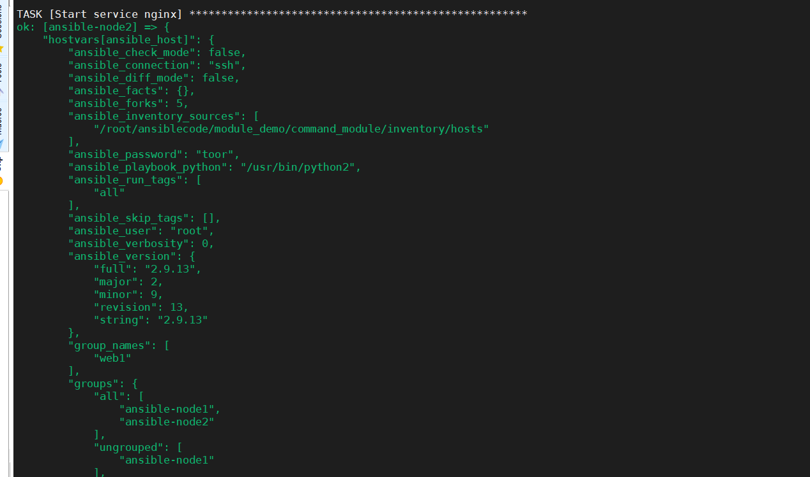
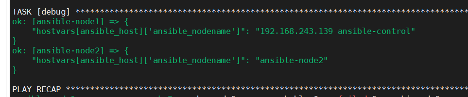
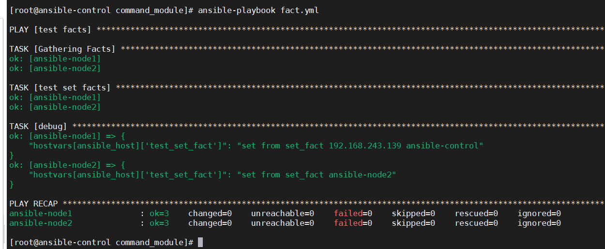
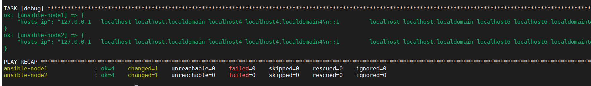

## set_fact 关键字

task中的单位是单个主机。

yaml的文件内部支持jinj2这种模板语言，使用方式"{{  Jinj2_var }}"

set_fact 模块，这个模块就是作为变量赋值用的

```
- name: test facts
  hosts: web1 
  gather_facts: no
  tasks:
    - debug:
        var: hostvars[ansible_host]
```



其中的基本单位就是以主机为单位，进行循环遍历

```
- name: test facts
  hosts: all 
  gather_facts: yes
  tasks:
    - debug:
        var: hostvars[ansible_host]['ansible_nodename']
```





## set_fact 设置变量

```
-  name: test facts
   hosts: all 
   gather_facts: yes
   tasks:
    -  name: test set facts
       set_fact:
         test_set_fact: "set from set_fact {{hostvars[ansible_host]['ansible_nodename']}}"
    -  debug:
        var: hostvars[ansible_host]['test_set_fact']
```

设置后，直接就可以从ansible_host读取出来。




如何实现，执行了command命令以后，将结果保存到fact中

```
-  name: test facts
   hosts: all 
   gather_facts: yes
   tasks:
    -  name: command
       command: cat /etc/hosts
       register: host_results
    -  name: set host results
       set_fact:
         hosts_ip: "{{ host_results['stdout'] }}"
    -  debug:
        var: hosts_ip
```



从这个例子中，也可以看出来只要涉及到变量，那么就需要使用Jinj2模板语言。


ansible 的fact会收集主机的各种详细信息，这些信息存储在facts变量中。ansible 收集fact会自动收集，但如果需要命令行收集，那么就需要增加setup参数

```
ansible server1 -m setup
```

fact非常非常多，可以使用匹配符去匹配key。

```
ansible web -m setup -a "filter=ansible_eth*"
```

一个问题？为什么能够直接使用fact收集的变量？

因为如果模块返回一个字典且其中包含 ansible_facts键，那么Ansible会为对应主机创建相应的变量。会将ansible_facts对应值中的所有键都创建变量。因此可以直接使用这些ansible_facts中的变量名

# 使用set fact定义新变量


内置变量
	hostvars
	inventory hostname
	groups
在命令行设置变量
优先级