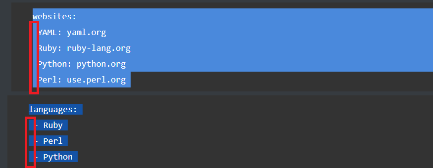
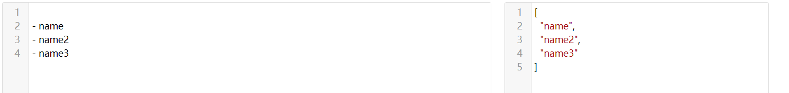
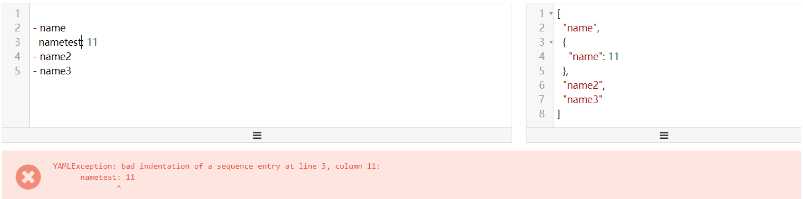

数据结构

## 对象

通过键值对，进行管理

```
name: value
```

注意点，value前面一定要有空格

### 字符串

字符串可以有双引号，也可以不需要双引号。

```
this is a string
'this is a string'
"this is a string"

# YAML 中若⼀⾏写不完你要表述的内容的时候，可以进⾏折⾏。写法如下:
long_line: |
 Example 1
 Example 2
 Example 3
# 或者
long_line: >
 Example 1
 Example 2
 Example 3
 
 
```


## 数组

一组连词线开头的行，构成一个数组。

```
- Cat
- Dog
- Goldfish
```

注意点，连词后面要跟上空格。同时数组都是与对象进行嵌套,比如下面这个格式

```shell
languages:
 - Ruby
 - Perl
 - Python 
```

## 字典格式

通过一组键值对组成的字典格式

```
YAML: yaml.org 
Ruby: ruby-lang.org 
Python: python.org 
Perl: use.perl.org 
```

字典格式中的值也是有一个空格。同时字典一般与对象进行嵌套使用，如下文

```
websites:
 YAML: yaml.org 
 Ruby: ruby-lang.org 
 Python: python.org 
 Perl: use.perl.org 
```

需要注意的是所有的嵌套都需要有一个空格




嵌套的话，数组和字典可以同时进行嵌套

```bash
companies:
 -
  id: 1
  name: company1
  price: 200W
 -
  id: 2
  name: company2
  price: 500W
等价于
companies: [{id: 1,name: company1,price: 200W},{id: 2,name: company2,price: 500W}]

companies:
 - host: web1
 - host1: web2
 等价于
 companies:[{host:web1},{host1:web2}]
```


同一层只能由一种数据结构，比如说都是数组的结构





## 混合结构

```
class:
 - name: stu1
   num: 001
 - name: stu2
   num: 002
 - name: stu3
   num: 003
# {'class': [{'name': 'stu1', 'num': 1},
			{'name':'stu2', 'num': 2},
			...
			]}

```

也可以如下


