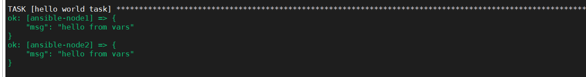
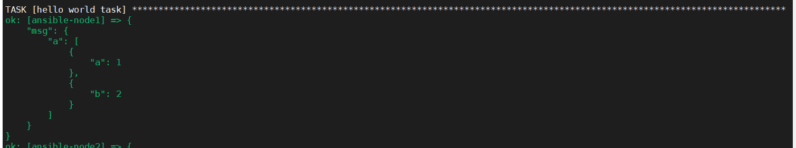

## 定义变量

定义方式：

### vars属性进行定义

与hosts同一级别

```yaml
- name: Hello world
  hosts: web1
  vars:
   greeting: "hello from vars"
  tasks:
  ...
```

### 外部引入变量

```yaml
-  name: test play var from file
   hosts: all
   var_file:
     -  vars/users.yml
   tasks:
   ...
```


## 使用变量

使用Jinj2模板语言，进行引用，使用大括号与双引号。

为什么需要使用双引号？

这样错误的主要原因是PlayBook 是YAML 的⽂件格式， 当Ansible 分析YAML ⽂件时，有可能会误认为字典。 name: {{ user }} 是⼀个字典的开始。因此加针对变量的使⽤，加 上了双引号，避免Ansible错误解析。

```yaml
- name: Hello world
  hosts: web1
  vars_files: 
   - vars_file/vars/demo.yaml
   vars:
    greeting: "hello from vars"
  tasks:
   - name: hello world task
     debug: 
       msg: "{{demo}}"
```


定义的变量可以在tasks中被引用。



变量也可以定义字典和数组

```
- name: Hello world
  hosts: web1
  vars:
   greeting: "hello from vars"
   demo:
    a:
     - a: 1
     - b: 2
  tasks:
   - name: hello world task
     debug: 
       msg: "{{demo}}"
```




变量也可以通过外部进行导入变量

```
- name: Hello world
  hosts: web1
  vars_files: 
   - vars_file/vars/demo.yaml
   vars:
    greeting: "hello from vars"
  tasks:
   - name: hello world task
     debug: 
       msg: "{{demo}}"
```

这样子的好处就是统一管理变量


变量优先级：

简单的来说就是后面覆盖前面。

两种情况，

+ 变量都在文件中，前面文件中的变量会被后面文件中定义的相同的变量覆盖
+ 外部引用的文件中的变量会被自己文件中后面定义的变量覆盖掉。