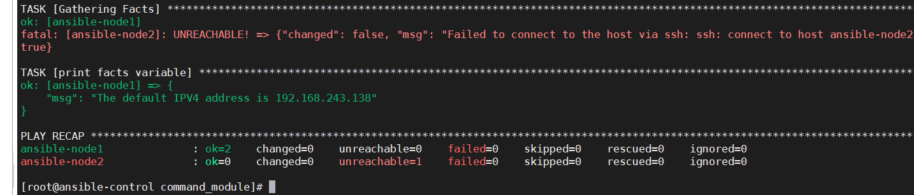
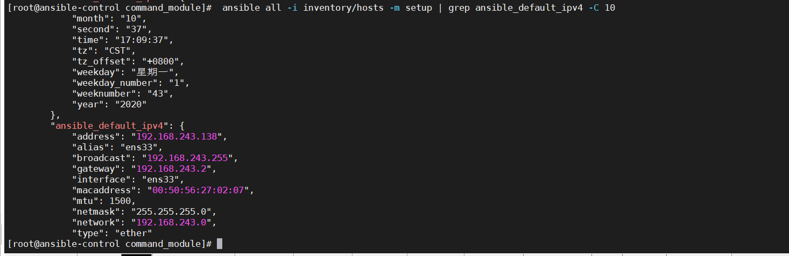

默认情况下，在执⾏PlayBook的时候，它会去⾃动的获取每台被 管理服务器的facts信息。若在整个PlayBook 的执⾏过程中，完全未使⽤过 Facts 变量，此 时我们可以将其关闭，以加快PlayBook的执⾏速度。

```yaml
- name: a play example
  hosts: webservers
  # 关闭 facts 变量收集功能
  gather_facts: no
  ...
```

## facts变量的使用

可以像使用其他变量一样，直接在playbook文件中使用

如下：

```yaml
-  name: print facts variable
   hosts: all
   gather_facts: yes
   tasks:
     - name: print facts variable
       debug:
         msg: "The default IPV4 address is {{ansible_default_ipv4.address }}"
```




直接套用变量,即可获得数据




如何获得数组中的数据？如何获得其他数据?那就通过JinJ2模板语言进行操作。