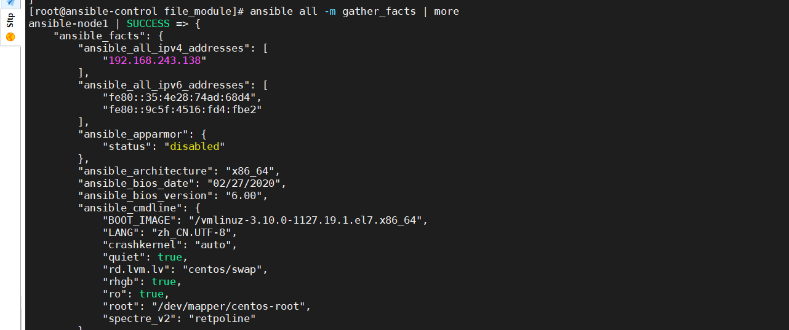

## `gather_facts`

获取节点机的一些基本信息



目的就是可以在playbook配置文件中使用这些变量

```

- name: file module
  hosts: web1
  tasks:
    - name: print gather_facts
      debug:
        msg:{{ ansible_date_time }}

```


