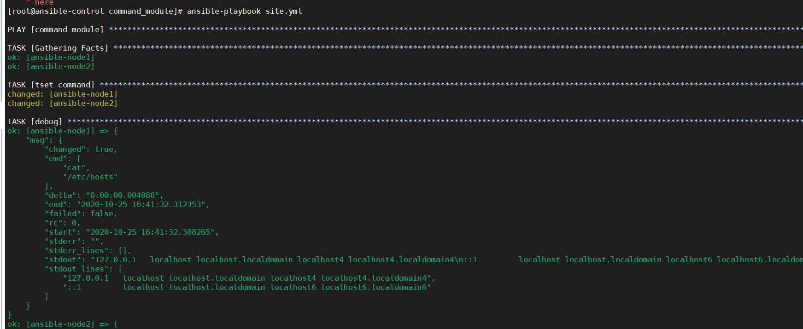
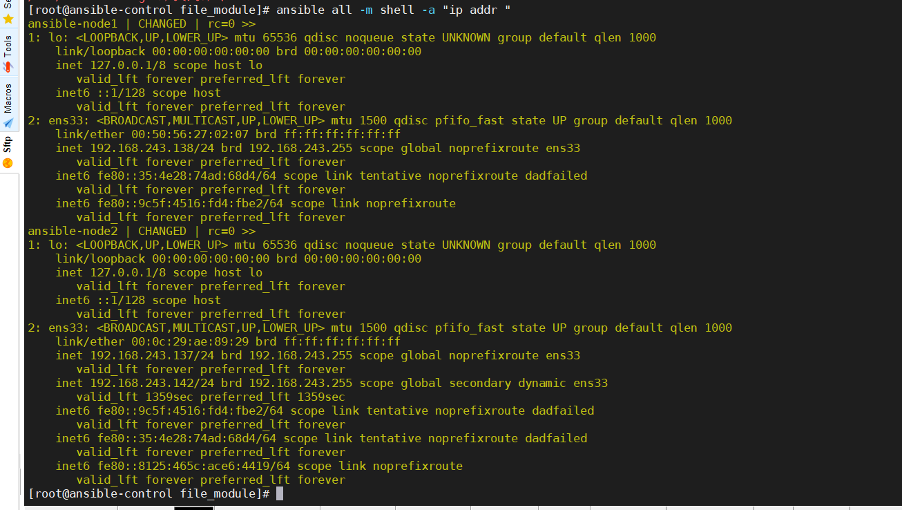

+ command模块

  目标机器上去执行一个命令，不涉及环境变量与操作符

+ shell模块

  目标机器上去执行一个shell命令

+ raw模块

  这个模块可以控制华为、思科的路由器，只要这两者支持ssh。


## command模块

```

- name: command module
  hosts: all
  become: yes
  tasks:
   - name: tset command
     command: cat /etc/hosts
```


但是，这个是没有响应的，因此，我们需要的是响应。

所有的模块都是由返回值的，我们通过返回值就可以知道执行的结果了。下面介绍了如何在play-book查看返回值，会返回一个json的数据结构。

```
- name: command module
  hosts: all
  become: yes
  tasks:
   - name: tset command
     command: cat /etc/hosts
     # 将返回值赋值给变量
     register: hosts_values
   - debug:
        msg: "{{hosts_values}}"
```




不同的模块会有一些常见的返回值。我们可以通过字典的形式去获取内容。


## shell命令


## `shell`命令

可以跟上一条命令，对所有的节点执行这条命令



shell是可以允许管道符的

