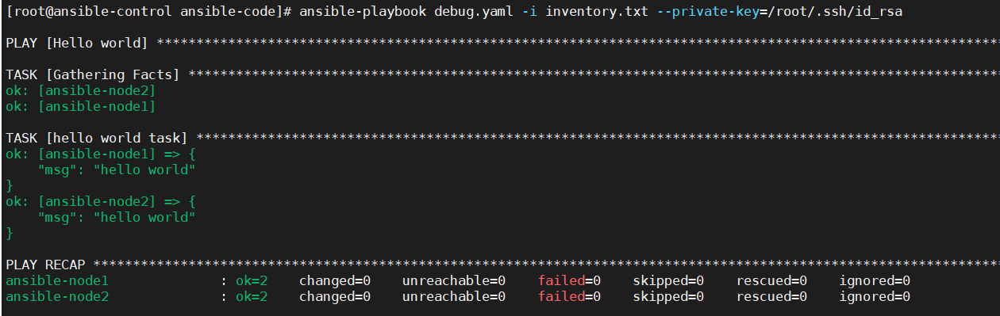
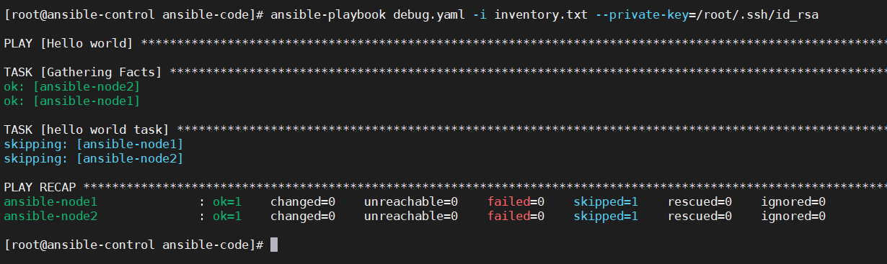

## debug模块

```bash
- name: Hello world
  hosts: web1
  
  tasks:
   - name: hello world task
     debug: 
       msg: "hello world"
```




可以看到 hello world task 这个task被执行了。

verbosity代表的是debug级别，调高后，就不会显示出来。默认是0

```
- name: Hello world
  hosts: web1
  
  tasks:
   - name: hello world task
     debug: 
       msg: "hello world"
       verbosity: 3
```



