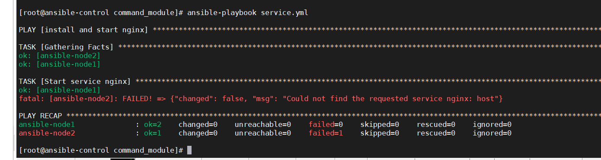

## service管理


包安装好之后，我们需要进行服务开启，比如安装好apache2，那么我们就需要进行apache2服务的开启。

```

- name: install and start nginx
  hosts: all
  tasks:
    - name: install nginx on centos
      become: yes
      yum:
        name:
          - epel-release
          - nginx
        state: present
        use_proxy: yes 
      when: ansible_facts['distribution'] == "CentOS"
    - name: Start service nginx
      become: yes
      service:
        name: nginx
        state: stopped

```





其他的选项：

state:

+ started
+ restarted
+ stoped


除了service软件管理，还有systemctl模块对软件可以进行管理。

## systemd

centos7就开始使用systemctl进行管理软件了。

常见参数：

+ daemon_reload 重新载入systemd、扫描新的或者有变动单元
+ enabled 是否开启启动该服务
+ name 服务名称，需要管理的服务
+ state 对对当前服务 执行started、stopped、restarted、reloaded操作

