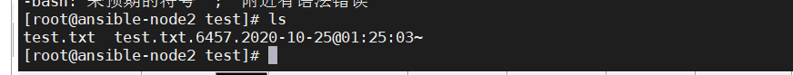
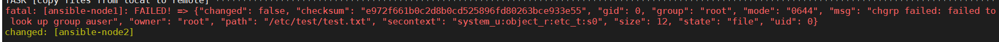

copy模块只是做文件的复制，不能创建目录

而copy则可以删除文件，创建文件夹

### file模块

copy之前，需要对文件夹进行创建，保证文件夹已经创建成功

```bash
- name: file module
  hosts: all
  gather_facts: no
  become: yes
  tasks:
    - name: Create a directory if it does not exist
      file:
        path: /etc/test
        state: directory

```


其中 become是进行提权

### copy模块

可以对文件进行备份

```
- name: file module
  hosts: all
  gather_facts: no
  become: yes
  tasks:
    - name: Create a directory if it does not exist
      file:
        path: /etc/test
        state: directory

    - name: copy files from local to remote
      copy:
        src: files/test.txt
        dest: /etc/test/test.txt
        backup: yes
```

backup 是备份，防止原文件被覆盖，这样子原来的文件就会以备份的形式加上一个时间戳保留下来。



copy模块，还可以指定文件的用户名和所在组

```
- name: copy files from local to remote
      copy:
        src: files/test.txt
        dest: /etc/test/test.txt
        ower: auser
        group: auser
        backup: yes
```

前提是这个文件名和所在组必须是存在与系统中，不然就会报错



