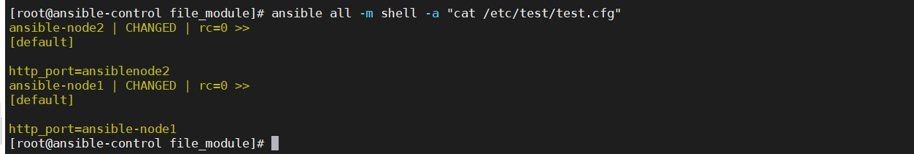

​	

这个模块，作用就是定义一个模板，然后把这个模板下发到各个控制节点。从而实现一台控制器，下发多个配置文件。

首先，从前面可以知道，只要遵循目录架构，那么就可以实现将所有的group变量与host变量从group_vars与host_vars中读取出来。所以在site.yml中可以直接使用这些变量，而不需要进行引用。

这里我一直经历了这个报错，`"Could not find or access 'template/test.txt'\nSearched `，后面才发现是自己的文件路径写错了，从而导致不能找到。

```
- name: test template
  template:
   src: template/test.j2
   dest: /etc/test/test.cfg
```

其中的test.j2内容如下

```
[default]

http_port={{ http_port }}
```

j2其实是使用了jinj2这个模板语言。

查看内容，已经成功被修改



