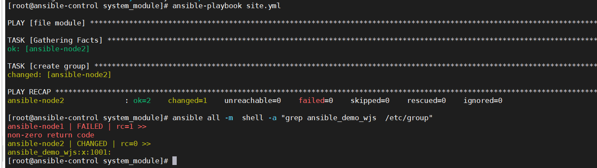
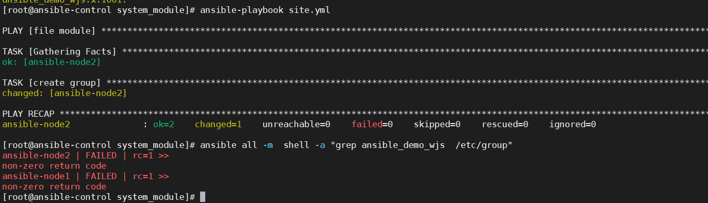
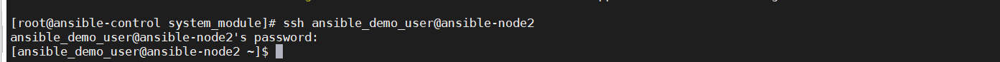
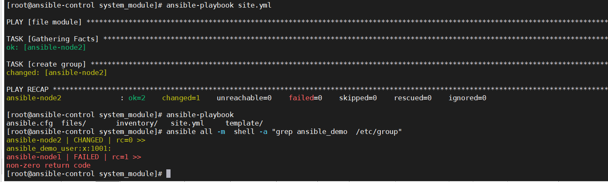

## `group`

group模块只有一个必填的参数就是名字

增加group

```

- name: file module
  hosts: web1
  tasks:

    - name: create group
      group: 
        name: ansible_demo_wjs
        

```

结果查看



删除group

这个就需要增加一个参数，state:absent 用来表示删除

```
- name: file module
  hosts: web1
  tasks:

    - name: create group
      group: 
        name: ansible_demo_wjs
        state: absent
```




## `user`

新增用户

```
- name: file module
  hosts: web1
  tasks:

    - name: create group
      user: 
        name: ansible_demo_user
        
```

为用户设置密码





结果展示



删除用户

```
- name: file module
  hosts: web1
  tasks:

    - name: create group
      user: 
        name: ansible_demo_user
        state: absent
        remove: yes # 将创建的用户的目录一起删除掉
```

