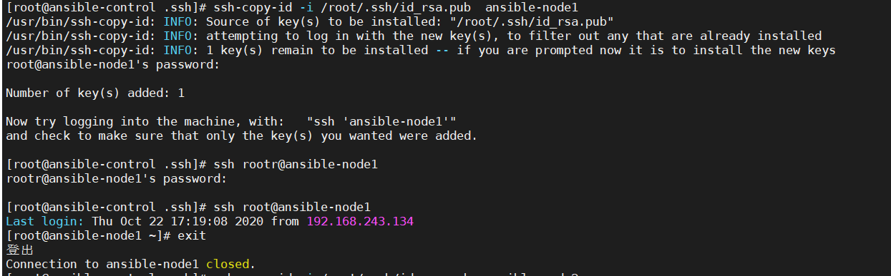

我们控制器，总是需要一个方法才能控制节点，与节点进行通信。下面介绍了几种方式

## ssh密码形式

这种方式，通过将ssh密码写入investory文件，与节点进行通信

```
ansible-node1 ansible-connection=ssh ansible_user=root ansible_ssh_pass=toor
```

上面的`ansible_ssh_pass`就是密码

## ssh  key密钥访问节点

+ 创建密钥

```
ssh-keygen
```

+ 将公钥放置到节点中

```
ssh-copy-id -i ./ssh/id_rsa.pub ansible-node1
```

`./ssh/id_rsa.pub 产生的公钥

 ansible-node1 指的是上传公钥的地址




现在已经成功的不需要密码就可以登陆到节点中。

investory文件内容中就可以不用写ansible_ssh_pass了。

```bash
[web1]
ansible-node[1:4] ansible-connection=ssh ansible_user=root 
```

输入命令的时候,带上private-key即可。

```bash
ansible web1 -m ping -i inventory.txt --private-key=/root/.ssh/id_rsa
```


```
sdjsijd
```


